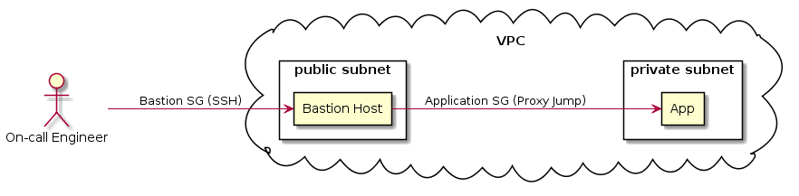

# Bastion Host Proof of Concept (PoC)

### TL;DR
Deploying a Bastion Host in AWS using CloudFormation.



## Why we need a Bastion?

Although [toil](https://cloud.google.com/blog/products/management-tools/identifying-and-tracking-toil-using-sre-principles)
is highly discouraged, sometimes we need to _ssh_ into an instance in order to
do some kind of debugging. As a result, we need to expose that instance to
the internet and that is _no bueno_. One way to prevent this from happening, is
to implement a Bastion Host.

The idea of implementing this is being able to reduce the attack surface of our
infrastructure by doing 2 things:

1. Remove the application instances (could also be database instances) or other
servers that are not meant to be open to the world.

2. Be able to harden one machine (the bastion) and not
each and every other server in our infrastructure. So in this case the ~~more~~
less the merrier.

Other benefit that the a Bastion Host can have is logging in order to prevent
[repudiation](https://searchsecurity.techtarget.com/definition/nonrepudiation).
This work because every engineer has their own key pair. So you can keep track
of what Alice and Bob did during their last session.

## Getting Started

### Prerequisites
Make sure you create a key pair in us-east-1 availability zone. We will use it
to connect to our instance.

### Set the vars

```
# deploy.sh

STACK_NAME=bastion-poc
REGION=us-east-1
CLI_PROFILE=<your-aws-profile-with-an-appropiate-role>
EC2_INSTANCE_TYPE=t2.micro
KEY_NAME=<your-key-pair-name>
```

### Run the script
```
./deploy.sh
```
After a couple of minutes you should see 2 IPs. When this happens we are golden
;)

#### Output
```
[
    "http://10.0.0.x",
    "http://x.x.x.x"
]

```

*Note: If you want to debug or see what happened go to the respective
CloudFormation stack in the AWS console.*

### Config your ssh config file

Go to ```~/.ssh/config``` and add the following hosts:
```
...

### The Bastion Host
Host bastion-host-poc
    HostName <public-ip-from-output>
    User ec2-user
    Port 22
    IdentityFile ~/.ssh/<your-key-pair-private-key>

### The App Host
Host app-host-poc
    HostName <private-ip-from-output>
    User ec2-user
    IdentityFile ~/.ssh/<your-key-pair-private-key>
    ProxyJump bastion-host-poc
```

### SSH your way in:
Go to your terminal and ssh to your app-host-poc
```
ssh app-host-poc
```

Voilà. You are inside a machine that is running in a private subnet. Isn't it
cool?

## Further Considerations
Remember, this is just a PoC. For example, the Application Instance
can still send traffic to the whole world (do you really want that?).
Similarly, the Bastion Instance has yet to be hardened.

Implementing a Bastion can be useful for your current processes, especially if
you have some instances exposed to the world and / or you want to control
who can _ssh_ into an specific instance.

Although you probably have a more sophisticated setup, a Bastion Host might be
the right solution for you, and this could be the kickstart of your
implementation.
